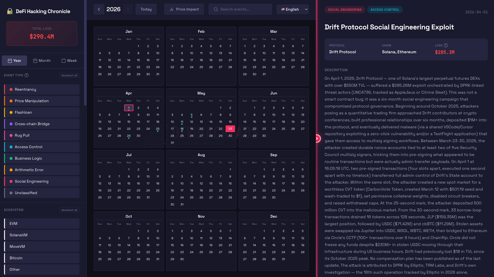
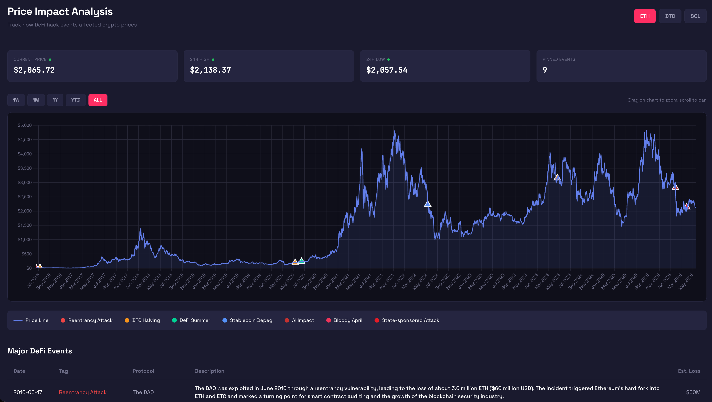

# DeFi Hack Chronicle

DeFi 安全事件編年史

[English](./README.md) | [日本語](./README.ja.md)

---

## 專案簡介

DeFi Hack Chronicle 是一個線上視覺化行事曆網站，用於記錄與探索歷史上重大的 DeFi 安全事件。

所有重大攻擊事件皆可透過行事曆頁面瀏覽、多維度篩選，以及深入的事件分析，最早的事件從 2016 年 The DAO 開始記錄。

安全研究員與開發者可以透過此網站，觀察 DeFi 重大安全事件對於幣價的影響，並快速匯出結構化的歷史事件資訊(JSON)，用於安全研究或教育訓練。

---

## 主要功能

- **多種檢視模式** — 年 / 月 / 週檢視
- **豐富篩選條件** — 依攻擊事件類型（重入攻擊、閃電貸攻擊、價格操縱等）、區塊鏈、生態系、程式語言、自訂日期範圍篩選
- **詳細事件分析** — 每筆事件包含根本原因、攻擊手法、經驗教訓、攻擊者／受害者地址、鏈上交易證據
- **多語言支援** — 內建英文、繁體中文、日文 UI，並支援逐筆事件的語言覆寫
- **市值影響觀察** — `/chart` 頁面顯示 Crypto 歷史價格走勢並標註重大事件時間點
- **匯出功能** — 將符合篩選條件的事件一次性下載為 JSON ZIP 壓縮檔，供後續研究使用
- **靜態資料驅動** — 任何人只需新增一個 JSON 檔即可向編年史新增事件，不需要改動程式碼（詳見 [CONTRIBUTE.md](./CONTRIBUTE.md)）

---

## 快速開始

技術細節請見 [DEVELOPER.md](./DEVELOPER.md)（專案結構、建置方式、部署說明）。

---

## 資料模型

每筆被駭事件是一個 JSON 檔（`public/data/hacks/YYYYMMDD-ProtocolName.json`），包含：

| 欄位 | 型別 | 說明 |
|------|------|------|
| `id` | string | 唯一識別碼（例：`dao-2016`） |
| `title` | string | 事件標題 |
| `protocol` | string | 被攻擊的協議名稱 |
| `blockchain` | string[] | 受影響的區塊鏈（例：`["ethereum", "bsc"]`） |
| `category` | string[] | 攻擊類型（例：`["reentrancy", "flashloan"]`） |
| `ecosystem` | string | 虛擬機生態系（`evm`、`solana`、`move` 等） |
| `language` | string | 智能合約語言（`solidity`、`rust` 等） |
| `estimatedLoss` | object | 美元損失金額與資產明細 |
| `attackTime` | object | 攻擊開始／結束時間、日期 |
| `description` | string | 事件描述 |
| `rootCause` | string? | 漏洞根本原因 |
| `attackVector` | string? | 攻擊手法 |
| `lessons` | string[]? | 經驗教訓 |
| `references` | string[]? | 參考連結（報告、事後分析） |
| `transactions` | object[]? | 鏈上交易證據 |
| `attackers` | object[]? | 攻擊者地址資訊 |
| `victims` | object[]? | 受害者地址資訊 |
| `locales` | object? | 各語言覆寫（`zh-TW`、`ja`） |

靜態 JSON 文件必須遵循 Schema 的規範，具體請見 [schema.json](./public/data/schema.json)。

---

## 貢獻指南

向編年史新增一筆黑客事件，僅需要**一個 JSON 檔**，不需要改動任何程式碼。

快速步驟：
1. Fork 本專案
2. 建立 `public/data/hacks/YYYYMMDD-ProtocolName.json`
3. 複製 [CONTRIBUTE.md](./CONTRIBUTE.md) 中的範本並填寫
4. 開啟 Pull Request

GitHub Actions 會在 push 時自動重新編譯索引。

完整貢獻指引，請查看 [CONTRIBUTE.md](./CONTRIBUTE.md)。

---

## 特別致謝

主要維護者: [whiteberets.eth](https://github.com/finn79426)

技術顧問: [SunSec](https://x.com/1nf0s3cpt)

資料來源：社群分析報告、鏈上分析、[DeFiHackLabs](https://github.com/DeFiHackLabs)
