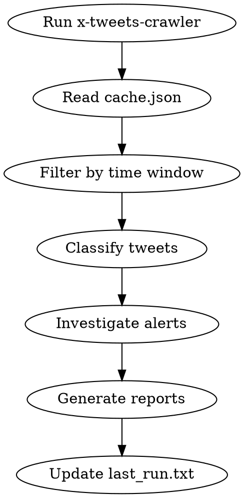

# Daily DeFi Hack Monitor

## Overview
Automated pipeline: fetch security tweets → classify attack alerts → investigate on-chain → generate multilingual hack reports matching `public/data/schema.json`.

## When to Use
- Cron job scheduled for daily execution
- New tweets detected from `@PeckShieldAlert`, `@SlowMist_Team`, `@BlockSecTeam`, etc.
- Need to classify whether a tweet describes an active exploit, victim protocol, tx hashes, or loss figures
- Need to investigate suspicious transactions and build a full report
- Output must include `zh-TW` and `ja` locale translations

**Do NOT use for:** manually editing existing reports.

## Workflow



### Step 1: Fetch Tweets
```bash
cd x-tweets-crawler && node index.mjs > tweets.json 2> monitor.log
```
- Runs zero-credential scraper (twstalker + vxtwitter APIs with fallbacks)
- Updates `cache.json` with fetched tweet objects
- Stderr shows progress, cache hits, and host health

### Step 2: Determine Time Window
Read `x-tweets-crawler/last_run.txt` for ISO timestamp of previous execution.
- Exists → window = `[lastRun, now]`
- Missing → use `config.lookbackHours` (default 24h) as fallback window

### Step 3: Filter & Classify Tweets
Read `cache.json`. Filter entries where `timestamp` ∈ `[lastRun, now]`.

**Thread Assembly (auto-done by crawler):** The crawler now merges same-account
replies into the parent tweet. Parent tweets carry:
- `replyThread[]` — array of `{id, text, timestamp, permalink}` for each reply
- `fullText` — combined text of parent + all replies (e.g. `"Alert: X hacked\n\n— Reply —\nTx: 0xabc..."`)

Classification MUST check `fullText` (if present) or `text + replyThread[].text`
rather than `text` alone, since key details (tx hashes, addresses, loss figures)
are often posted in follow-up replies.

**Classification Criteria (all must be true for positive):**
1. Tweet mentions a **protocol name** being attacked / exploited / drained
2. Contains **wallet addresses**, **tx hashes**, or **external URLs** with on-chain data
3. Author is verified security account (PeckShield, SlowMist, BlockSec, CertiK, Cyvers, Beosin, zachxbt, samczsun, etc.)
4. **NOT** general security advice, conference announcements, or phishing warnings without victim protocol

**Examples:**

| Tweet | Classification |
|-------|-------------|
| "Huma Finance exploited for $1.2M, attacker 0xabc… tx 0xdef…" | Alert |
| "Stay safe, never share private keys" | Ignore |
| "We audited ProtocolX last month" | Ignore |
| "PeckShieldAlert: #Dexible on #Arbitrum exploited ~$2M" | Alert |

**Output:** Array of `AlertTweet` objects with fields: `id`, `text`, `timestamp`, `permalink`, `monitoredHandle`, `confidence` (high/medium/low).

### Step 4: Investigate Each Alert
For each confirmed alert, extract entities and investigate on-chain.

**4.1 Entity Extraction**
Parse the combined content (`fullText` if available, otherwise `text` + all
`replyThread[].text` entries) and linked URLs for:
- **Protocol name** (victim)
- **Blockchain** (Ethereum, Arbitrum, BSC, etc.)
- **Attacker addresses** (EOA or contract)
- **Victim contract addresses**
- **Transaction hashes** (primary exploit tx, follow-up txs)
- **Loss figures** (USD, token amounts with symbols)
- **External references** (blog posts, GitHub repos, audit reports)

**4.2 On-Chain Investigation**
Use whatever on-chain analysis tools or skills are available. You may use block explorers, dedicated APIs, or any other resources at your disposal.
- If you have an **Etherscan API Key** available in the environment (`$ETHERSCAN_API_KEY`), use it for deeper Ethereum mainnet contract and transaction analysis.
- For other chains, use the corresponding explorer APIs (Arbiscan, BscScan, etc.) if keys are available.
- If no API keys are available, rely on public block explorer web interfaces and standard scraping techniques.

**Information to gather:**
- [ ] Identify attack transaction(s) — the tx that initiated the exploit
- [ ] Trace fund flow — where did stolen assets go? (bridges, mixers, CEX?)
- [ ] Analyze victim contract code — look for missing validation, reentrancy, price oracle manipulation
- [ ] Determine attack vector — flash loan, reentrancy, access control, etc.
- [ ] Calculate total loss in USD (use token prices at attack time if possible)
- [ ] Build timeline: first suspicious tx → exploit → fund movement
- [ ] Identify root cause in 1-2 sentences

**4.3 External Research**
- Follow any links in tweet for official announcements
- Search for protocol's post-mortem blog post
- Check if any security firm already published detailed analysis
- Gather additional tx hashes from linked resources

### Step 5: Generate Report
Create a JSON file matching `public/data/schema.json` **EXACTLY**, YOU MUST FOLLOWING THE RULE THAT WRITTEN IN schema.json.

**Required fields:**
- `id`: `YYYYMMDD-ProtocolName` (e.g., `20260511-HumaFinance`)
- `title`: English title (e.g., "Huma Finance Exploit")
- `protocol`: Protocol name
- `blockchain`: Chain where attack occurred
- `category`: Attack vector (e.g., reentrancy)
- `ecosystem`: Ecosystem name (e.g., "Arbitrum", "Ethereum")
- `language`: Programming language (e.g., "solidity")
- `estimatedLoss`: `{ totalUSD: number, breakdown: [{ token: string, amount: number, valueUSD: number }] }` — **Do not trust loss figures from tweets, blog posts, or any external links unless transaction analysis is impossible. Derive from on-chain transaction analysis whenever possible.**
- `attackTime`: `{ startTime: ISO, endTime: ISO, date: YYYY-MM-DD }`
- `description`: 2-3 paragraphs explaining what happened
- `date`: YYYY-MM-DD
- `metadata`: `{ human_verified: false, dateAdded: ISO, lastUpdated: ISO }`

**Optional fields (include if available):**
- `transactions`: Array of `{ txHash, type: "exploit"|"fund_movement"|"flash_loan", description }`
- `attackers`: Array of `{ address, type: "EOA"|"contract", label }`
- `victims`: Array of `{ address, type: "contract"|"wallet", name }`
- `rootCause`: 1-2 sentence root cause
- `attackVector`: Technique used (flash loan, reentrancy, price manipulation, etc.)
- `lessons`: Array of lessons learned
- `references`: Array of URLs (tweets, blog posts, analysis articles)

**Locales (required):**
- `locales.zh-TW`: Full translation of all human-readable string fields (title, description, rootCause, attackVector, lessons, transactions[].description, attackers[].label, victims[].name)
- `locales.ja`: Same coverage as zh-TW

**File naming:** `YYYYMMDD-ProtocolName.json` (camelCase protocol name, no spaces)
**Save location:** `public/data/hacks/`

### Step 6: Update State
Write current ISO timestamp to `x-tweets-crawler/last_run.txt`.
- Only update if Step 1 completed successfully
- If pipeline crashes before report generation, do NOT update last_run (re-process on next run)

## State Files
| File | Purpose |
|------|---------|
| `x-tweets-crawler/cache.json` | Tweet cache (auto-updated by monitor). Parent tweets may include `replyThread[]` and `fullText` from thread assembly. |
| `x-tweets-crawler/last_run.txt` | ISO timestamp of last successful pipeline execution |
| `public/data/hacks/*.json` | Generated investigation reports |

## Execution Log Format
After each run, output a structured log to stderr with one entry per tweet processed:

```
[TWEET] <monitoredHandle> — <tweet text excerpt or 1-line summary>
[CLASS] confirmed_alert | ignore
[REASON] <why this classification was chosen>
```

**Example:**
```
[TWEET] PeckShieldAlert — Huma Finance exploited for $1.2M on Ethereum
[CLASS] confirmed_alert
[REASON] mentions victim protocol (Huma Finance), contains loss figure ($1.2M), security account

[TWEET] SlowMist_Team — Stay safe, never share your private keys
[CLASS] ignore
[REASON] general security advice without victim protocol or on-chain identifiers
```

## Error Handling
| Scenario | Action |
|----------|--------|
| x-tweets-crawler fails | Log error, exit without updating last_run |
| Individual alert investigation fails | Log error, skip to next alert, continue pipeline |
| Insufficient data for report (< 1 tx hash + protocol name) | Skip report generation, log reason |
| Missing zh-TW or ja translation | Generate report anyway, mark translation as pending in metadata.notes |
| Duplicate protocol on same date | Append suffix `-2`, `-3` to id (e.g., `20260511-Protocol-2`) |

## Quick Reference

### Monitor Config
Edit `x-tweets-crawler/config.json` to tune:
- `lookbackHours`: How far back to fetch (default 24)
- `rateLimitDelayMs`: Delay between API requests (default 5000ms)
- `interAccountDelayMs`: Delay between accounts (default 10000ms)
- `maxFetchPerAccount`: Max tweets per account (default 10)
- `useBrowserFallback`: Enable Playwright fallback when APIs fail

### Investigation Priorities
1. **Exploit transaction trace** — value transfers, internal calls, event logs
2. **Attacker address activity** — pre/post attack behavior, deployed contracts
3. **Victim contract code** — read source if verified, identify vulnerability
4. **Stolen token movements** — fund flow to bridges, mixers, CEX
5. **Attacker wallet profile** — balances, tags, linked addresses

### Report Checklist
- [ ] `id` follows `YYYYMMDD-ProtocolName` format
- [ ] `metadata.human_verified` is `false`
- [ ] `locales.zh-TW` and `locales.ja` cover ALL string fields
- [ ] `estimatedLoss.totalUSD` is numeric (not string)
- [ ] `attackTime.date` matches `date` field
- [ ] At least one transaction hash in `transactions`
- [ ] `references` includes original tweet permalink
- [ ] Checked `replyThread`/`fullText` for any key info in follow-up replies
- [ ] File saved to `public/data/hacks/`

## Common Mistakes
- **Forgetting last_run update** → re-processes same tweets daily, duplicates alerts
- **Missing locale translations** → zh-TW or ja fields empty, schema violation
- **Wrong date format** → use YYYY-MM-DD for `date`, ISO 8601 for timestamps
- **Skipping investigation** → report has only tweet text, no on-chain evidence
- **Not validating schema** → run `python3 -m json.tool` on generated report before saving
- **Over-classifying** → general security advice flagged as alert, wastes investigation time
- **Ignoring reply threads** → key tx hashes/addresses in `replyThread` or `fullText` are missed, leading to incomplete reports or false negatives

## Red Flags
- Tweets without protocol names or tx hashes → likely not an alert
- Investigation with 0 transaction traces → insufficient data, skip report
- Attacker address equals victim contract → likely misidentified, re-verify
- Loss figure contradicts on-chain transfers → double-check token decimals and prices
